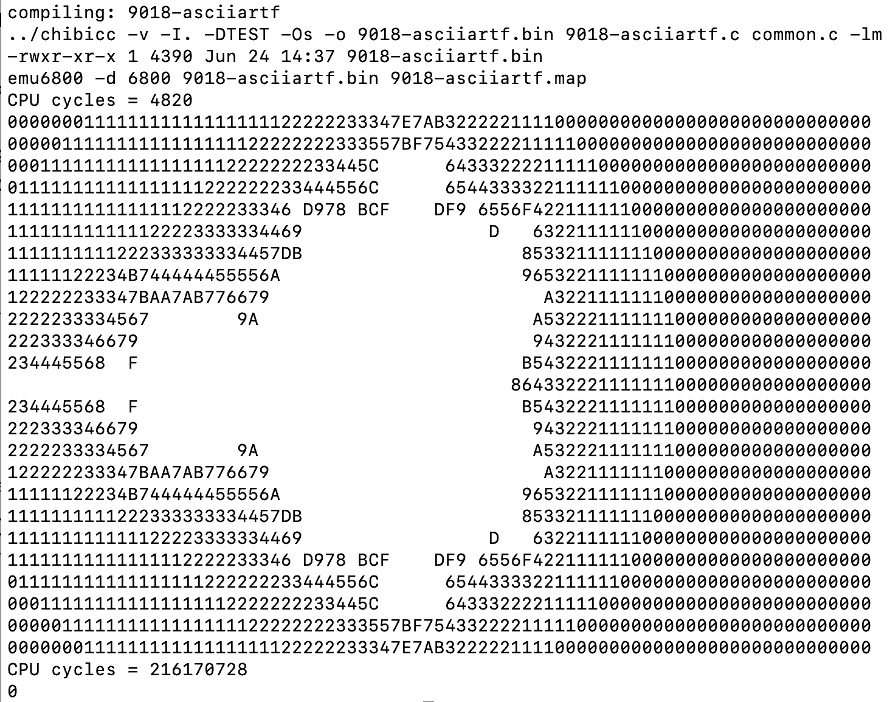

# chibicc-6800-v1: C Compiler for MC6800

## Overview

This is a Motorola MC6800 cross-compiler based on [@rui314](https://www.sigbus.info/)'s [chibicc](https://github.com/rui314/chibicc/).

The compiler targets the MC6800 and is designed to generate efficient code. It works well on the MC6800 and provides good performance.

Many C programs, including Dhrystone and Whetstone benchmarks, now run successfully on the MC6800. The compiler also supports IEEE 754 32-bit floating-point operations through an assembly implementation.

Some parts of the code may exist for testing, and some code and comments remain from the implementation process. If you find any issues, feedback is welcome.

----
# Topics

- **Data types:** `int` and pointers are 16-bit; `long` and `float` are 32-bit. `double` and `long long` (64-bit or more) are unsupported.
- **Function parameters:** Only the first parameter is passed via registers (A/B/@long). If the first parameter is a struct/union, all parameters are passed via the stack.
- **Return values:** Struct/union return values pass their address as an implicit first argument in a register. All other normal arguments are passed on the stack.
- **IEEE 754 floating-point:** 32-bit floating-point arithmetic is implemented in assembly language, making it faster and smaller than a C implementation. It can handle subnormal, NaN, and Inf values. Basic arithmetic operations have good precision, but other functions may have reduced precision.
- **Structs/unions:** Passing and returning by value are implemented, but they increase code size. Using pointers is recommended instead.
- **Bit fields:** Implemented, but generally discouraged because they generate inefficient code.

The compiler passes basic tests. If you find any issues, please report them.

The original chibicc uses stack-based operations when generating code, while also taking advantage of the many registers available on x64. This is inefficient on the MC6800, which has few registers and limited stack support. chibicc-6800-v1 optimizes code generation for the MC6800.

Fuzix-BinTools is required to assemble and link compiled objects.
For testing, we use emu6800 from Fuzix-Compiler-Kit.

- https://github.com/EtchedPixels/Fuzix-Bintools
- https://github.com/EtchedPixels/Fuzix-Compiler-Kit

---

# Installation

Follow the steps below to set up the environment for chibicc-6800.

## 1. Install Fuzix-Bintools

First, install [Fuzix-Bintools](https://github.com/EtchedPixels/Fuzix-Bintools).  
Please refer to the instructions in the Fuzix-Bintools repository's README.md for details.

Make sure that the installed binaries (e.g., `as6800`, `ld6800`) are available in your `$PATH`.

## 2. Install Fuzix-Compiler-Kit

Next, install [Fuzix-Compiler-Kit](https://github.com/EtchedPixels/Fuzix-Compiler-Kit).  
Please follow the installation instructions in the Fuzix-Compiler-Kit repository's README.md.

## 3. Install `emu6800` Emulator

After installing the Fuzix-Compiler-Kit, you need to install the `emu6800` emulator for testing.

Copy the emulator binary to the appropriate directory:

```sh
cp test/emu6800 /opt/fcc/bin/
```

> **Note:**  
> Make sure that `/opt/fcc/bin/` is included in your `$PATH` environment variable.

## 4. Verify Installation

You can verify that the tools are installed correctly by running:

```sh
which chibicc
which emu6800
which as6800
which ld6800
```

All commands should return the path to the respective binaries.

---

## Example: Running Test Programs

You can run test programs automatically using the provided onetest script:

```sh
cd ztest
./onetest 9018-asciiartf.c
```

To run all tests, use runall.

```sh
cd ztest
./runall
```

Alternatively, you can manually compile and run a test program as follows:

```sh
cd ztest
chibicc -v -O2 -o 9018-asciiartf.bin 9018-asciiartf.c -lm
emu6800 6800 9018-asciiartf.bin 9018-asciiartf.map
```

This will compile the source file and execute the resulting binary using the emulator.



---
## Usage on Other Platforms

To run this compiler on systems other than `emu6800`, you can specify the target platform using command-line options. Depending on the option, the appropriate startup code (`crt0*.s`), program start address, initial stack pointer, and link-time addresses are automatically configured.

### Target Options

* **Default (No option):** Generates code for `emu6800` (uses `crt0.s`).
* **`-tmikbug`:** MIKBUG (uses `crt0_mikbug.s`)
* **`-tbm`:** Hitachi BASICMASTER L2 / L2II / Jr (uses `crt0_bm.s`)
* **`-tjr100`:** National JR-100 (uses `crt0_jr100.s`)
* **`-tjr200`:** National JR-200 (uses `crt0_jr200.s`)

If you need to use this compiler on a platform not listed above, you will need to create a custom `crt0` file and specify the appropriate link-time parameters.

By running with `-vv`, such as `chibicc -vv a.c`, you can check how chibicc performs compilation and linking. Please use this as a reference:

```
$ chibicc -vv a.c
chibicc -vv a.c -cc1 -cc1-input b.c -cc1-output /tmp/chibicc-tGegnu 
/opt/fcc/lib/copt /opt/chibicc/lib/copt.rules 
/opt/fcc/lib/copt /opt/chibicc/lib/copt_O2.rules 
as6800 -o /tmp/chibicc-cuScKa /tmp/chibicc-Vhhfpv 
ld6800 -b -C256 -Z0 -m a.map -o a.bin /opt/chibicc/lib/crt0.o /tmp/chibicc-cuScKa /opt/chibicc/lib/dummyfloat.o /opt/chibicc/lib/clibs.a /opt/chibicc/lib/libc.a
```

> **Note:** While I am familiar with `emu6800` and the BASICMASTER series, my familiarity with other architectures is limited. If you encounter any bugs or wish to request support for additional platforms, please open an issue.

## Examples

The following projects by kwhr0 utilize this compiler:

- [bm2-baremetal-demo](https://github.com/kwhr0/bm2-baremetal-demo)
  - A bare-metal implementation for the Hitachi BASICMASTER
- [kwhr0/bm2-xevious](https://github.com/kwhr0/bm2-xevious)
  - famous retro game
- http://kwhr0.g2.xrea.com/hard/68vs80/index.html

---
# Performance

## Integer Operations

- **Dhrystone benchmark:** 234 seconds at 1MHz on MC6800, equivalent to approximately 0.05 DMIPS.
  - Update: 183.56 seconds, 0.062 DMIPS (2025/09/17).
  - Update: 179.84 seconds, 0.063 DMIPS (2025/11/13).
  - Update: 160.84 seconds, 0.070 DMIPS (2026/01/10).

If running on 2MHz MC68B00: 0.1407 DMIPS, comparable to HITECH C CPM V309-15 (0.1278 DMIPS).
MC6800 has no block transfer instructions (unlike Z80), yet sufficiently fast.

- **Source code:** z88dk/support/benchmarks/dhrystone21 at master · z88dk/z88dk : https://github.com/z88dk/z88dk/tree/master/support/benchmarks/dhrystone21

## Floating-Point Operations
- **Mandelbrot ASCII renderer (`asciiartf`):** 266 seconds at **1MHz on MC6800**.
  - Update: 198.8 seconds (2025/08/09)
  - Update: 182.0 seconds (2025/11/12)
- **Source code:** [`ztest/9018-asciiartf.c`](https://github.com/zu2/chibicc-6800-v1/blob/main/ztest/9018-asciiartf.c)  

- **Whetstone benchmark:** 449.5355 seconds at **1MHz on MC6800**, equivalent to approximately 2.2245 KWIPS, .0022245 MWIPS
  - Update: 2.7544 KWIPS, 0.027544 MWIPS (2025/06/12)
  - Update: 358.0215 seconds, 2.793 KWIPS, .002793 MWIPS (2025/08/09)
  - Update: 317.2384 seconds, 3.152 KWIPS, .003152 MWIPS (2025/11/13)

- **Source code:** [z88dk/support/benchmarks/whetstone at master · z88dk/z88dk](https://github.com/z88dk/z88dk/tree/master/support/benchmarks/whetstone)

## String and Memory Operations
- `strcmp`, `strcpy`, and `strcat` operate on two bytes at a time, resulting in high performance.
- Other `str*` and `mem*` functions are also implemented to minimize the number of comparisons and branches, further improving efficiency.

## Function Calls and Branching
- Despite the slow function prologue and epilogue, overall performance remains high.
- For `char` and `int`, direct branching is generated without relying on subroutines.
- For `long`, optimized subroutines are used for comparison, providing relatively fast execution.
- Recursive functions such as Ackermann ([`9005-ack.c`](https://github.com/zu2/chibicc-6800-v1/blob/main/ztest/9005-ack.c)) and Takeuchi's tarai ([`9100-tarai.c`](https://github.com/zu2/chibicc-6800-v1/blob/main/ztest/9100-tarai.c)) run efficiently, even with the overhead of function prologue and epilogue.

# Code Generation Details

## 8-bit Integer Code Generation Details

Integer types are 8-bit char, 16-bit short and int, and 32-bit long. Pointers are 16-bit. bool values are stored internally as 8-bit values.

C's integer promotions cause operations on bool and char values to be usually performed as int operations.

On the MC6800, most arithmetic and logical operations are performed on 8-bit values. Handling 16-bit values requires additional instructions and is more expensive.

Therefore, it is important to keep 8-bit values as 8-bit whenever possible. The original chibicc follows the C standard and creates an AST with integer promotions applied. chibicc-6800-v1 analyzes and transforms the AST to remove unnecessary promotions. It also generates 8-bit operations where possible during code generation. In particular, generating 8-bit conditional branches can significantly improve performance on the MC6800.

These optimizations are carefully designed to preserve the original C semantics of integer promotions.

## 16-bit Integer Code Generation Details

The MC6800 has very limited register resources. It provides two 8-bit accumulators (A and B) and one 16-bit index register (IX) for general-purpose code generation. Since int operations use 16-bit values, A and B are used together as AccAB, leaving very few available registers.

The IX register plays an important role in code generation. It is mainly used for address calculations, stack variables, pointers, and array accesses. Unlike AccAB, IX cannot perform general arithmetic operations. Its available operations are limited to increment, decrement, and simple comparisons such as equality checks and checks for negative or non-negative values. In addition, IX cannot be directly saved and restored using the stack.

For 16-bit values, keeping calculations in IX whenever possible can generate more efficient code, because moving values between IX and AccAB requires additional instructions. When calculating addresses for global variables and local variables with fixed offsets, AccAB is avoided whenever possible.

Because IX is needed for many operations and cannot be easily saved, tracking and reusing the value held in IX is important for generating efficient code on the MC6800.

The original chibicc uses stack-based operations when generating code, while also taking advantage of the many registers available on x64. This approach is effective on x64, but it is inefficient on the MC6800, which has few registers and limited stack support.

## Details of Long Integer Arithmetic

- Supports 32-bit `long` integer operations.
- The MC6800 has only 8-bit accumulator registers (AccA and AccB), so 32-bit operations require multiple steps and are more expensive.
- `long long` (64-bit) is not supported because its larger data size and implementation cost are too expensive for the MC6800's limited memory.

The compiler generates long integer operations using a stack-oriented code generation model. To improve performance, it generates code that uses registers effectively where possible. Long integer helper routines, such as multiplication and division, are implemented in assembly language for better performance.

## Details of Floating-Point Arithmetic

- Supports IEEE 754 32-bit single-precision `float`.
- Only round-to-nearest mode is supported.
- Handles subnormal numbers.
- `double` and `long double` are not supported because their larger data sizes and implementation cost are too expensive for the MC6800's limited memory.
- Provides basic arithmetic operations and several floating-point functions, including `fabsf`, `fsqrtf`, `floorf`, and `ceilf`. Some functions are implemented, but many are still missing. If you need a specific function, please open an issue.

The IEEE 754 float implementation is written in assembly language, providing better performance and smaller code size than a C implementation. Other parts are still being improved.

---
# Optimization Options

## Supported Optimization Flags

- The compiler supports the `-O` and `-Os` optimization options.
- You can also specify `-O0`, `-O1`, `-O2`, and `-O3`.
- The default optimization level is `-O2`. The `-O` option is equivalent to `-O2`.

## Details of Each Option

- **`-O0`**:
  Performs the same basic optimizations as `-O1`, but disables peephole optimization.

- **`-O1`**:
  Enables basic optimization with peephole optimization.

- **`-O`**:
  Equivalent to `-O2`.

- **`-O2`**:
  Enables a higher optimization level than `-O1`. It may generate larger code.

- **`-O3`**:
  `-O3` is an experimental feature. It includes the optimizations of `-O2` and may generate self-modifying code. Review the generated code before using it.

- **`-Os`**:
  This option generates code aimed at minimizing code size. It uses helper calls more aggressively to reduce code size. In particular, function prologues and epilogues are replaced with helper calls, which can significantly slow down small functions due to the additional call overhead. This trade-off can be useful on the MC6800, where memory is very limited.

Note that `-O2` and higher may place local variables in static storage when possible. This behavior can be disabled with the `-nostatic-locals` option.

## Options for Code Generation Verification

- `-g2` (or `-gg`): Embeds the C source code as comments into the output assembly source (`.s`).
- `-g3` (or `-ggg`): Embeds the Abstract Syntax Tree (AST) and other information as well.

> **Note:** If the embedded debug information is excessively long and exceeds the maximum line length supported by the assembler, it may cause an assembly error.

---
# Design Notes

## Stack Frame

This compiler inherits the frame pointer design from the original x64 version of chibicc. A virtual register (`@bp`) is used to access local variables and arguments.

Since the 6800 does not have enough registers to dedicate one as a frame pointer, `@bp` is implemented in the zero page.

Unlike other 6800 compilers that obtain the stack position using `tsx`, chibicc-6800 uses `ldx @bp`. Although this requires one more byte in the instruction, the number of CPU cycles is the same.

Accessing local variables often requires `ldx @bp`. Pointer operations can also frequently generate sequences such as `ldx @bp` followed by `ldx n,X`, which are inefficient. To reduce these cases, this compiler tracks the state of the IX register and avoids generating unnecessary loads whenever possible.

Normally, the stack pointer and `@bp` point to the same location. When they match, `tsx` is generated instead of `ldx @bp`, saving one byte of code size.

For local array access, address calculations involving `@bp` and an index are required. Compilers without a frame pointer may need to store the temporary stack position, such as with `STS @tmp`. Since chibicc-6800 keeps the frame pointer in `@bp`, these extra stores can be avoided in such cases.

### Key points:

- **Frame Pointer Usage:** Required for supporting `alloca` and Variable-Length Arrays (VLA).
- **Performance Tradeoff:** Functions with a frame pointer are slightly slower due to saving/restoring it during prologue/epilogue.
- **Comparison with Other Compilers:** CC68 and Fuzix CC use the stack pointer (SP) directly, which is more efficient but requires precise SP tracking.
- **Future Plans:** Support for `alloca`/VLA may be removed in favor of SP-only implementation for simplicity.

Since `alloca` and VLAs use stack space and the size isn't known in advance, accessing locals and arguments via the stack pointer becomes tricky after allocation.  
The frame pointer (@bp) helps by providing a stable reference point.  
VLAs are accessed through a pointer saved on the stack.  
When the function returns, the old frame pointer is used to restore the stack properly.

```
// @bp points old @bp,argument
//
// SP  -> stack top
//        alloca/VLA area
// @bp -> local var top
//             :
//        local var end
//        argment passed by register AB or @long (if any)
//        old @bp
//        return address
//        argments passed by stack
```

## Function Arguments Handling

In this implementation:

1. Function arguments are discarded by the caller (unlike CC68/Fuzix CC where this happens in the callee).
2. The caller performs stack adjustment using `INS`, which increases code size due to frequent calls.
3. The first argument of the function is passed in a register. If the first argument is 8-bit, it is passed in AccB. If it is 16-bit, it is passed in AccAB. If it is long/float, it is passed with 4-byte @long area in zero page.

### Tradeoffs:

- **1 Argument:** Efficient; no `PUSH` and `INS` needed.
- **2 Arguments:** Equivalent; one `PUSH` removed but requires an `INS`.
- **3+ Arguments:** Less efficient due to additional `INS`.

Register-based arguments are saved during the prologue and accessed as local variables within functions. Further optimizations in this area are possible.

If stack restoration is fast with @bp, compiler use ldx @bp / txs. For many arguments, this gives shorter and faster code.

### Function Arguments Handling

Adjusting the stack in the called function can make the return process trickier. Instead of just using `RTS`, you'll need extra instructions like `tsx/ldx 0,X/ins.../jmp 0,X`. However, if many `ins` instructions are required, the difference in how the callee restores the stack becomes less significant.

## float/long in zero page

long/float are handled as 4-byte variables (@long) on the zero page.

This is different from the CC68 and Fuzix CC methods. They are handled using AccA/B and as 2-byte values on the zero page.

When Acc A/B are used together, long/int mixed operations are advantageous.

For example, sign-extend int to long.

```
    ldx #0
    tsta
    bpl L1
    dex
L1: stx @hireg
```

all bytes on zero page (chibicc-6800).

```
    ldx #0
    stab @long+3
    staa @long+2
    bpl L1
    dex
L1: stx @long
```

On the other hand, AccA/B are fragile, so they may need to be saved and restored when performing long/float operations.

In the chibicc-6800, everything is on the zero page for clarity.

`@long` is also used when passing function arguments via registers. If the first (most significant) argument of a function is a `long` or `float`, it is passed through `@long`. This avoids the need for a 4-byte long push and multiple `ins` instructions.

### Passing long/float Arguments

When calling a function with a long or float argument using register passing, a zero page area (@long) is used for the argument. If the return value of one function is passed directly as an argument to the next function, the call can be made without any additional cost.

For example:

```
#include "float.h"
#include "math.h"

int main(int argc, char **argv)
{
    float x=-2.0;
    float z;

    z = sqrtf(fabsf(x));
}
```

After storing the value of x into @long, we can call fabsf and then sqrtf in sequence. There is no need to restore the stack, making the operation efficient.

```
    ldab 7,x
    stab @long+3
    ldab 6,x
    stab @long+2
    ldab 5,x
    stab @long+1
    ldab 4,x
    stab @long
    jsr _fabsf
    jsr _sqrtf
```


## Conditional branch

8bit/16bit Integer's conditional branching is fast. It uses direct comparisons (not subroutines). 

For longs and floats, a subroutine is called for comparisons, but the code is written to reduce the number of comparisons as much as possible, so it is fast enough.

For example, take a look at some of the code generated by ztest/9100-tarai.c

```
int tarai(int x, int y, int z)
{
	if (x>y){
		return tarai(
			tarai(x-1,y,z),
			tarai(y-1,z,x),
			tarai(z-1,x,y));
	}
	return y;
}
```

Branches "if (x\>y)" are converted to jge (bge) instructions.

`x>y` and `x>=y` have different branch costs. `x-y>=0` requires one bge, but `x-y>0` requires multiple branch instructions. The chibicc-6800 reduces the branch cost by treating the former as `y-x<0`.

```
	ldab 9,x
	ldaa 8,x
	subb 3,x
	sbca 2,x
	jge L_end_5
	ldab 9,x
	ldaa 8,x
	pshb
	psha
	ldab 3,x
	ldaa 2,x
	pshb
	psha
	ldab 11,x
	ldaa 10,x
	subb #<1
	sbca #>1
	jsr _tarai
	ins
	ins
	ins
	ins
```

## Large size object / local area

IX addressing can only use offsets from 0 to 255, so there are limitations. If an offset greater than 255 is needed, calculations using AccAB are required, which leads to less efficient code.

- When returning a struct or union from a function, its size must be less than 256 bytes.
- When the total size of local variables and arguments is more than 252 bytes, certain limitations apply.
- Local area refers to temporary variables, including those allocated by assignment, alloca, or variable-length arrays (VLA).

## Bitfield Support

> **Warning:** Bit fields result in inefficient code on the MC6800, and their use is not recommended.

Bit fields allow you to pack multiple small integer values into a struct to save memory. However, handling bit fields on the MC6800 is generally inefficient. Accessing or modifying a bit field requires multiple shift and bitwise operations (such as AND and XOR) to isolate or update specific bits. Because of this, it increases the instruction count and runs slower than accessing regular integer struct members.

- Bit fields are always packed into 16-bit (`int`) units, starting from the least significant bit (bit 0) of each word.
- When a non-bitfield member appears in a struct, bitfield packing stops, and any following bitfields start at the next 16-bit boundary.
- Zero-width fields (e.g., `unsigned int : 0;`) force alignment to the next 16-bit boundary.
- In unions, the lowest-addressed byte corresponds to the upper 8 bits of the bitfield word, and the highest-addressed byte to the lower 8 bits.
- The size of a struct or union containing bitfields is rounded up so that all bitfields fit into full 16-bit units.

### Example:

```
struct S {
  unsigned int a : 5;
  _Bool        b : 1;
  unsigned int c : 10;
  unsigned char d;
  unsigned int e : 12;
};
```

- a, b, and c are packed into the first 16-bit word.
- d is placed at the next byte.
- e starts at the next 16-bit word.

---
# Reference compilers

[@rui314](https://www.sigbus.info/)'s [chibicc](https://github.com/rui314/chibicc/)

- [rui314/chibicc: A small C compiler](https://github.com/rui314/chibicc/)

Other compilers that may be useful to study.

slimcc and widcc are forks of chibicc. They add features and clean up the code.

Fuzix C and CC6303 contain compilers for the MC6800. The former also has float.

acwj and mc09 are compilers for the MC6809.

ack includes compilers for languages other than C as well.

- [fuhsnn/slimcc: C11 compiler with C23/C2y/GNU extensions for x86-64 Linux/BSD](https://github.com/fuhsnn/slimcc)
- [fuhsnn/widcc: Simple C compiler for x86-64 Linux able to build real-world projects including Curl, GCC, Git, PHP, Perl, Python, PostgreSQL etc](https://github.com/fuhsnn/widcc)
- [EtchedPixels/Fuzix-Compiler-Kit: Fuzix C Compiler Project](https://github.com/EtchedPixels/Fuzix-Compiler-Kit/)
- [zu2/CC6303: A C compiler for the 6800 series processors](https://github.com/zu2/CC6303)
- [acwj/64\_6809\_Target at master · DoctorWkt/acwj](https://github.com/DoctorWkt/acwj/tree/master/64_6809_Target)
- [sbc09/mc09 at os9lv2 · shinji-kono/sbc09](https://github.com/shinji-kono/sbc09/tree/os9lv2/mc09)
- [zu2/ack-6800: The Amsterdam Compiler Kit for MC6800](https://github.com/zu2/ack-6800)

---
---
Rui's original README.md link.

- [chibicc/README.md at main · rui314/chibicc](https://github.com/rui314/chibicc/blob/main/README.md)
